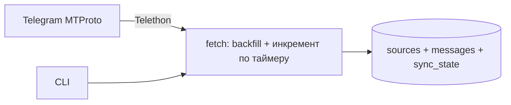

# Этап 1: выгрузка Telegram → Postgres

Цель этапа: личный архив текста из whitelist-источников. Backfill истории до границы архива и инкрементальные обновления. Данные лежат в своей БД и готовы к любой дальнейшей обработке — но сама обработка в этот этап не входит.

Проект пустой. Масштаб: 50–200 источников.

## Согласованные решения

| Решение | Выбор |
|---------|-------|
| Источники | Whitelist: каналы вручную + их чаты комментариев автоматически + группы вручную |
| Доступ | Каналы и группы — только те, где аккаунт уже состоит; чаты комментариев читаем без вступления и никогда не вступаем (ADR-0004) |
| Параллелизм | Postgres advisory lock: одновременно с Telegram работает ровно один процесс |
| Лимиты | Обычная сессия, пауза около секунды на запрос, retry по FloodWait; takeout не используем |
| Наблюдаемость | Отчёт в Saved Messages после каждого синка и при ошибке; отсутствие отчёта — сигнал тревоги |
| Бэкапы | Вне этапа 1 |
| Медиа | Только текст и caption |
| Метрики | `views` и `reactions` сохраняем как снимок на момент выгрузки, не обновляем |
| Граница архива | 2024-01-01, общая для всех Source (ADR-0003) |
| Порядок | Per-source: backfill запускается сразу при добавлении Source, инкремент включается по его `backfill_done` |
| Обновление | systemd timer на Linux-сервере только для инкремента, не daemon |
| Деплой | VPS: Postgres в docker-compose, приложение — uv-окружение на хосте |
| Правки | Не детектируем: текст остаётся таким, каким был на момент выгрузки |
| Удаления | Не детектируем: архив — снимок на момент выгрузки, удалённое в Telegram остаётся в БД |
| Отписка | Данные остаются, Source помечается inactive |
| Форум-топики | Сохраняем `topic_id` как есть |
| Репосты | Каждый репост — отдельное Message |
| Пилот | Маленький whitelist на усмотрение пользователя |

## Доменная модель

- **Source** — любой индексируемый Telegram-чат: канал, чат комментариев (linked discussion group), группа. _Avoid_: channel (слишком узко).
- **Message** — сырая единица из Telegram (1 запись в БД). Включает посты канала, комментарии, сообщения в группах. _Avoid_: msg, запись, document.
- **CommentChat** — linked discussion group канала; отдельная группа, куда попадают комментарии под постами. _Avoid_: discussion group, подканал.
- **ThreadRoot** — автокопия поста канала в CommentChat, вокруг которой группируются комментарии. Единственный мост между комментарием и постом. _Avoid_: корневое сообщение, автофорвард.
- **Граница архива** — дата, старше которой сообщения не выгружаются. _Avoid_: cutoff, since.

### Сценарии

- **Правка поста** → ничего не делаем: в БД остаётся редакция на момент выгрузки (ADR-0001).
- **Удаление поста** → ничего не делаем: Message остаётся в БД (ADR-0001).
- **Репост в 3 канала** → 3 отдельных Message (разные Source, разные даты).
- **Отписка** → `Source.is_active=false`, данные на месте.
- **Комментарий через 3 дня** → сохраняем `reply_to_msg_id` и `reply_to_top_id` как есть; треды не собираем на этом этапе, но данных для этого хватит.
- **Чат комментариев недоступен** → Source остаётся с `is_active=false` и `inactive_reason=no_access`; вступать вручную нельзя (ADR-0004).
- **Обрыв backfill** → Source остаётся с `backfill_done=false`, инкремент его не трогает, добирающий таймер продолжает с `oldest_processed_id`.

## Архитектура



Fetch пишет сырые Message. Нормализация в треды, чанкинг, эмбеддинги и поиск — вне этого этапа.

Внутри fetch выделен узкий порт `TelegramReader` — единственное место, которое знает про Telethon. Вся логика курсоров, границы архива и фильтрации пустых сообщений живёт перед ним и тестируется на заглушке без сети.

## Стек

- **Python 3.12**, пакетный менеджер `uv`.
- **Telethon 1.44**, личный аккаунт, сессия `~/.tg-data/session`.
- **Postgres 17** (без pgvector), docker-compose.
- **SQLAlchemy 2.0 + Alembic**, **Typer**, **pydantic-settings**.

## Схема БД

```sql
sources(
    id,
    tg_id,                          -- Telegram peer id
    kind enum(channel|comment_chat|group),
    username,
    title,
    linked_channel_id,              -- для comment_chat: на какой канал ссылается
    added_at,
    is_active,
    inactive_reason                 -- почему выключен: no_access | disabled_by_user
)

messages(
    id,
    source_id,
    tg_msg_id,
    date,
    edit_date,
    text,                           -- текст или caption
    entities jsonb,
    reply_to_msg_id,
    reply_to_top_id,                -- корень треда: комментарий → ThreadRoot
    grouped_id,
    topic_id,
    fwd_from jsonb,
    views,
    reactions jsonb,
    UNIQUE(source_id, tg_msg_id)
)

thread_roots(
    source_id,                      -- CommentChat, где лежит ThreadRoot
    root_msg_id,                    -- tg_msg_id автокопии поста в CommentChat
    channel_source_id,              -- канал-владелец поста
    channel_msg_id,                 -- tg_msg_id поста в канале
    UNIQUE(source_id, root_msg_id)
)

sync_state(
    source_id,
    oldest_processed_id,    -- курсор backfill: min(tg_msg_id) уже пройденных сообщений
    newest_processed_id,    -- курсор инкремента: max(tg_msg_id) на момент СТАРТА backfill
    backfill_done,
    last_sync_at
)
```

Поля `reply_to_msg_id`, `reply_to_top_id`, `grouped_id`, `topic_id`, `fwd_from` пишем сразу: они нужны, чтобы потом собирать треды без повторной выгрузки.

`newest_processed_id` фиксируется в момент старта backfill, а не по его завершении: backfill идёт от новых к старым и может длиться часами, и всё опубликованное за это время должно достаться инкременту. Иначе оно окажется выше курсора и будет потеряно навсегда — правки и пропуски мы не перечитываем.

Сообщения без `text` и без `caption` (фото без подписи, стикеры, голосовые, служебные) **не сохраняются**. В альбоме сохраняем только элементы с caption; `grouped_id` пишем для связи. Media-метаданные (`media jsonb`, `raw jsonb`) не хранятся — только текстовое содержимое.

ThreadRoot как Message не сохраняется — это дословная копия поста канала, который уже лежит в БД. Вместо этого строка пишется в `thread_roots`: связь берётся из `fwd_from.saved_from_peer` и `saved_from_msg_id` автокопии. Проверять надо именно `saved_from_*`, а не `fwd_from.channel_post`: если пост канала сам был репостом, `channel_post` укажет на чужой исходный канал.

## Структура проекта

```
tg_data/
  cli.py            # typer: точка входа
  config.py         # pydantic-settings, .env
  db/               # SQLAlchemy 2.0 модели + alembic
  fetch/            # Telethon: auth, backfill, инкремент, rate limits
docker-compose.yml  # postgres
pyproject.toml      # uv, Python 3.12
CONTEXT.md          # глоссарий
```

## CLI

- `tg auth` — вход в личный аккаунт
- `tg sources add` / `tg sources disable` / `tg sources enable` / `tg sources list` — whitelist
- `tg sources purge` — физически удалить Source вместе с его Message, с подтверждением
- `tg sources discover` — нумерованный список чатов аккаунта с фильтром по подстроке, отсортированный по top peers rating (запасной порядок — дата последнего сообщения); уже добавленные помечены, добавление по номерам
- `tg sources sync` — подтянуть метаданные и автодобавить comment chat к каналам
- `tg pull --backfill` — выкачка истории до границы архива; `sources add` запускает её фоновым одноразовым systemd unit, ssh можно закрыть
- `tg pull --backfill --resume-all` — добрать все Source с `backfill_done=false` (отдельный таймер, раз в час: лечит обрывы ssh, ребуты и долгие FloodWait)
- `tg pull` — инкремент: только сообщения новее `newest_processed_id`, только по Source с `backfill_done` (по таймеру, каждые 6 ч)
- `tg stats` — сколько Source / Message, прогресс backfill, возраст последнего успешного синка

После каждого прогона в Saved Messages уходит короткий отчёт: сколько новых Message, по скольким Source, что упало. Он же служит heartbeat — если отчётов нет, значит сломалось что-то, о чём сам процесс сообщить уже не может (разлогиненная сессия, лежащий сервер).

## Порядок работ

1. Scaffold: uv, CLI, конфиг, Postgres, модели, миграции.
2. Auth + управление whitelist, включая `discover`.
3. Backfill по одному Source с checkpoint в `sync_state`, до границы архива.
4. Инкрементальный pull, таймер добора backfill, отчёты; деплой на VPS.

## Задачи

- [ ] **scaffold** — uv + pyproject (Python 3.12), typer CLI, pydantic-settings, docker-compose Postgres 17, SQLAlchemy 2.0 + alembic, CONTEXT.md, README
- [ ] **fetch-auth** — Telethon auth (`tg auth`, интерактивно по ssh на сервере); `tg sources add/discover/disable/enable/list/purge/sync`
- [ ] **fetch-backfill** — `TelegramReader` поверх `iter_messages` до границы архива, `sync_state`, advisory lock, text+caption only, reply_to / reply_to_top_id / grouped_id / topic_id / fwd_from, `thread_roots`, FloodWait retry
- [ ] **fetch-timer** — инкрементальный pull только новых сообщений + таймер добора незавершённых backfill; отчёты в Saved Messages; systemd units, деплой на VPS

## Риски и меры

- **FloodWaitError** — retry с уважением `seconds`, один Source за раз, checkpoint в `sync_state`.
- **ToS Telegram** — без агрессивного параллелизма, разумные паузы между Source.
- **Обрыв backfill** — `oldest_processed_id` позволяет продолжить, а не начинать заново; часовой таймер добора не даёт Source замереть незамеченным.
- **Удаления и правки в Telegram** — не детектируем на этапе 1. Архив — снимок на момент выгрузки (ADR-0001).
- **Вступление в чат комментариев** — необратимо отрезает старую историю, если у группы скрыта пре-история. Никогда не вступаем и не предлагаем этого пользователю (ADR-0004).
- **Объём комментариев** — комментариев кратно больше, чем постов, и это основная масса архива. Сдерживается границей 2024-01-01 и тем, что ThreadRoot не дублируется в `messages`.
- **Отвязка discussion group** — старый CommentChat становится inactive; новый синхронизируется как новый Source при следующем `tg sources sync`.
- **Тихая остановка на сервере** — разлогин сессии, кончившийся диск или не поднявшийся после ребута Postgres не порождают ошибку, которую кто-то увидит. Лечится отчётом-heartbeat: тревога поднимается по отсутствию отчёта, а не по его содержимому.
- **Потеря сервера** — бэкапов на этапе 1 нет. Восстановление означает повторную выгрузку с нуля, и всё удалённое или отредактированное в Telegram за это время вернётся уже другим или не вернётся вовсе.
